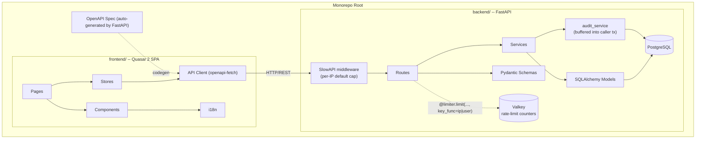
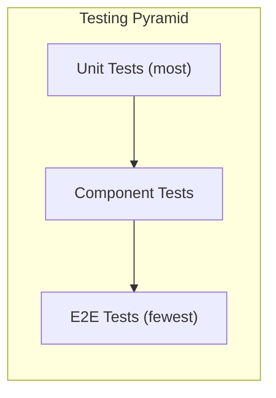

# Exetasi Implementation Plan

This document is the **canonical implementation plan** for building Exetasi as described in [Requirements.md](../../Requirements.md). It lives in the repo so contributors and agents can reference it without relying on local Cursor plan storage.

## Architecture Overview



Two stateful dependencies: **PostgreSQL** (primary data, including the append-only `audit_logs` table) and **Valkey** (ephemeral rate-limit counters shared across uvicorn workers). Both are brought up by `docker-compose.yml` at the repo root; Valkey is hardened in `infra/valkey/valkey.conf` (no persistence, bounded memory, admin commands renamed, loopback bind).

## Tech Stack

**Frontend** (existing scaffold, will be moved to `frontend/`)

- Quasar 2, Vue 3, TypeScript (strict), Pinia (setup-syntax stores), vue-i18n 11, Vue Router 4 (hash mode)
- `openapi-typescript` + `openapi-fetch` for typed API client
- Vitest + `@vue/test-utils` for unit/component tests
- Playwright for E2E tests

**Backend** (new, `backend/`)

- FastAPI, Python 3.12+, Pydantic v2
- SQLAlchemy 2.0 (async) + asyncpg, Alembic for migrations
- Authlib for OAuth 2.0 (Google, GitHub, GitLab)
- `itsdangerous` for signed session cookies; `slowapi` + `redis-py` for Valkey-backed rate limiting
- uv for dependency management
- pytest + httpx (async) + factory-boy for tests

**Dev Infrastructure** (root)

- `docker-compose.yml` for **PostgreSQL** (primary store) and **Valkey** (rate-limit counters); both bound to `127.0.0.1` by default
- `infra/valkey/valkey.conf` — hardened Valkey config (no persistence, dangerous commands renamed, memory cap, TLS stanza ready)
- `.env.example` — template / source of truth for environment variables; `.env` is gitignored
- `Makefile` targets: `infra-up`/`infra-down`, `db-up`/`db-down`, `valkey-up`/`valkey-down`, `dev-backend`/`dev-frontend`, `db-verify` (COMPOSE-agnostic: `docker compose` by default, `nerdctl compose` supported via `COMPOSE=…`)
- CI-ready structure (lint, test, build)

## Monorepo Structure

```
exetasi/
  frontend/              # Quasar SPA (moved from root)
    src/
      api/               # Generated OpenAPI client + wrapper composables
      boot/              # Quasar boot files (i18n, auth, api)
      components/        # Shared components by domain
        auth/
        exam/
        grading/
        org/
        shared/          # Generic reusable components
      css/               # Global SCSS + Quasar variables
      i18n/              # Translation files
      layouts/           # Page wrapper layouts
      pages/             # Route-level page components
        auth/
        dashboard/
        exam/
        grading/
        org/
        profile/
      router/            # Vue Router setup + route guards
      stores/            # Pinia stores (one per domain)
      types/             # Shared TypeScript interfaces
    test/
      unit/              # Vitest unit tests
      component/         # Vue Test Utils component tests
      e2e/               # Playwright E2E tests
  backend/
    app/
      api/
        deps.py          # get_current_user, session cookie, etc.
        v1/              # Route modules: auth, users, orgs, exams, audit, health
      core/
        config.py        # pydantic-settings; prod guards (SESSION_SECRET, rate-limit storage)
        ratelimit.py     # slowapi Limiter + ip_key/user_key functions
        security.py      # signed-cookie helpers
      db/                # async engine + session factory
      models/            # SQLAlchemy models (user, organization, exam, audit)
      schemas/           # Pydantic request/response schemas
      services/          # Business logic (session_service, org_service, audit_service)
      utils/             # ip.py (trusted-proxy aware), slug.py, username.py (OAuth sanitization)
    migrations/versions/ # Alembic revisions
    tests/
      test_auth*.py, test_audit.py, test_rate_limit_*.py, ...
    pyproject.toml
  infra/
    valkey/valkey.conf   # hardened Valkey config mounted into the valkey service
  docker-compose.yml     # PostgreSQL + Valkey (loopback-bound, health-checked)
  .env.example           # single source of truth for env vars / secrets
  Makefile               # infra-up/down, db-up/down, valkey-up/down, dev-*, test, lint
```

## Phase checklist

| Phase | Focus                                                                       |
| ----- | --------------------------------------------------------------------------- |
| 0     | Monorepo restructure, backend scaffold, testing infrastructure, dev tooling |
| 1     | Authentication (OAuth, sessions, user profile)                              |
| 2     | Organizations and membership                                                |
| 3     | Exam and version management                                                 |
| 4     | Question and answer editor (all six types)                                  |
| 5     | Exam taking flow                                                            |
| 6     | Grading queue                                                               |
| 7     | Analytics and reporting                                                     |
| 8     | Notifications, audit log, certificates, import/export, media storage        |

> Phases are not strictly sequential. Cross-cutting platform work (rate limiting, audit logging, org theming, role awareness) is documented separately in [Security & Operations](#security--operations-implemented) below — some of it lands ahead of the phase that formally consumes it.

---

### Phase 0: Monorepo Setup and Infrastructure

**Goal:** Restructure repo, set up both projects, establish dev workflow and testing infrastructure.

**Backend setup:**

- Initialize FastAPI project in `backend/` with uv
- SQLAlchemy 2.0 async engine + session management
- Alembic configuration
- Base model class with common fields (id, created_at, updated_at)
- Health check endpoint (`GET /api/v1/health`)
- pytest + httpx test infrastructure with DB fixtures (using test database)
- CORS middleware configured for frontend dev server

**Frontend changes:**

- Move all Quasar files into `frontend/` subdirectory
- Replace example-store (Options API) with setup-syntax pattern
- Remove scaffold demo code (EssentialLink, ExampleComponent, models.ts, IndexPage todos)
- Install and configure `openapi-typescript` + `openapi-fetch`
- Create API boot file that initializes the OpenAPI client
- Set up Vitest with `@vue/test-utils` (config, test helpers, component mounting utilities)
- Set up Playwright (config, base fixtures, first smoke test)
- Add codegen script: fetch OpenAPI spec from backend, generate types

**Root-level:**

- `docker-compose.yml` with PostgreSQL 16
- `Makefile` with targets: `dev-backend`, `dev-frontend`, `dev` (both), `test`, `lint`, `codegen`, `db-up`, `db-down`, `db-verify` — `COMPOSE` defaults to `docker compose`; use `COMPOSE='nerdctl compose'` for containerd + nerdctl

**Exit criteria:** Both servers start, frontend can call backend health endpoint, one passing test on each side.

---

### Phase 1: Authentication and User Management

**Goal:** OAuth 2.0 login (Google, GitHub, GitLab), session management, user profile CRUD.

**Backend:**

- `User` model (id, username, bio, avatar_url, created_at, is_deleted)
- `OAuthAccount` model (provider, provider_user_id, user_id)
- `Session` model (token, user_id, expires_at, last_active_at) with sliding-window refresh (1-week inactivity expiry)
- OAuth 2.0 endpoints: `/auth/{provider}/authorize`, `/auth/{provider}/callback`
- `GET /auth/providers` returning which OAuth providers have credentials configured — UI gates the login buttons on this
- OAuth state stored in an HttpOnly+SameSite signed cookie; validation failures redirect to `/#/login?error=…` and clear the state cookie (no raw 400s)
- OAuth-provided handles normalised via `app.utils.username.sanitize_oauth_username` before being used
- User profile endpoints: `GET/PATCH /users/me`, `DELETE /users/me`
- Changing `username` re-runs `ensure_personal_organization` so the personal-org slug stays in sync
- Auth middleware: extract session token from cookie/header, populate `request.state.user`
- Username uniqueness validation

**Frontend:**

- Auth store (`useAuthStore`): login flow, session persistence, logout, current user
- Login page: dynamically renders only the providers returned by `/auth/providers`; shows admin env-var instructions when nothing is configured; surfaces `?error=oauth_state|oauth_provider` in a banner
- Auth boot file: check session on app start, silent token refresh
- Route guard: redirect unauthenticated users to login
- User profile page: view/edit username, bio, avatar
- Account deletion flow with confirmation dialog

**Key i18n keys:** `auth.login`, `auth.logout`, `auth.provider.*`, `profile.username`, `profile.bio`, `profile.deleteAccount`, `profile.deleteWarning`

**Tests:**

- Backend: OAuth callback (mocked provider), session creation/expiry, user CRUD, username uniqueness
- Frontend: Auth store unit tests, login page component test, route guard behavior
- E2E: Full login flow (mocked OAuth), profile edit, logout

---

### Phase 2: Organizations and Membership

**Goal:** Personal org auto-creation, team orgs, member management with roles.

**Backend:**

- `Organization` model (id, name, slug, description, avatar_url, is_personal, owner_user_id) plus theming fields (primary/secondary palette, banner URL, icon URL)
- `Membership` model (user_id, org_id, role: `owner | editor | grader | viewer`, typed via `MembershipRole` Literal in `app/models/organization.py`)
- Auto-create personal org on user registration (slug = username slug, resynced whenever username changes — see `org_service.ensure_personal_organization`)
- Org CRUD endpoints: `POST/GET/PATCH /orgs`, `GET /orgs/{slug}`
- Membership endpoints: `POST/DELETE /orgs/{slug}/members`, `PATCH /orgs/{slug}/members/{username}/role`
- Role-based permission checks (dependency injection)
- Org deletion with cascade (exams, attempts, audit entries)
- "Last owner" guard: prevent sole owner from leaving/being demoted

**Frontend:**

- Org store (`useOrgStore`): current org, org list, members
- Org creation/edit pages (including theming: primary/secondary colour, banner URL, icon URL via `OrgAvatar` / `OrgBanner` components and the `useOrgTheme` composable that applies CSS custom properties scoped to the org)
- Member management page (add by username, change roles, remove)
- Personal org warning when creating exams (slug changes with username)
- Org deletion confirmation with impact summary
- Org switcher in sidebar/header

**Tests:**

- Backend: Org CRUD, membership role checks, personal org slug sync, last-owner guard, cascade deletion
- Frontend: Org store tests, member management component tests
- E2E: Create org, invite member, change role, leave org

---

### Phase 3: Exam and Version Management

**Goal:** Exam CRUD, version lifecycle, section management.

**Backend:**

- `Exam` model (id, name, public_description, private_description, org_id, is_archived, visibility, created_by)
- `ExamVersion` model (id, exam_id, name, public_description, private_description, is_active, config JSON)
- `Section` model (id, version_id, name, descriptions, sort_order, config overrides, questions_to_draw)
- `ExamAllowlist` model (exam_id, user_id) for restricted visibility
- Exam endpoints: CRUD + archive/unarchive
- Version endpoints: create (copy from previous), activate, config update
- Section endpoints: CRUD + reorder
- Visibility: public vs restricted with allowlist management

**Frontend:**

- Exam store (`useExamStore`): exams list, current exam, versions
- Exam list page (with search, archive filter)
- Exam detail/edit page
- Version management panel: create new version (copy from), activate, config editor
- Section manager: add/remove/reorder sections, section config overrides
- Version config form covering all settings from the spec (time limit, randomization, scoring, etc.)
- QR code generation for sharing

**Tests:**

- Backend: Exam CRUD, version activation (auto-deactivate previous), section reordering, visibility checks
- Frontend: Exam store tests, version config form component tests
- E2E: Create exam, add version, configure sections, archive/unarchive

---

### Phase 4: Question and Answer Editor

**Goal:** Full question editor supporting all 6 question types.

This is the most complex frontend phase. Each question type has distinct UI requirements.

**Backend:**

- `Question` model (id, section_id, type, private_description, image_url, point_value, sort_order, config overrides)
- `QuestionPhrasing` model (id, question_id, markdown_text)
- Answer models per type:
  - `MCOption` (id, question_id, text, image_url, is_correct, percentage_weight, is_in_incorrect_pool)
  - `FillBlank` (id, question_id, phrasing_id, blank_number, grading_mode, accepted_values JSON, point_weight)
  - `DragDropItem` (id, question_id, text, image_url, correct_position)
  - `MatchingPair` (id, question_id, left_text, left_image_url, right_text, right_image_url, is_distractor)
- Question CRUD endpoints with type-specific validation
- Reorder + move-between-sections endpoints
- Image upload endpoint (pluggable storage backend interface)

**Frontend:**

- Question store (`useQuestionStore`)
- Question list per section with drag-to-reorder
- Type selector when creating a question
- Type-specific editor components:
  - `McEditor.vue`: correct/incorrect options, weights, total-to-show, penalty config
  - `OpenEndedEditor.vue`: character limit config
  - `FillBlankEditor.vue`: markdown with `{{n}}` preview, per-blank grading mode + accepted values
  - `DragDropEditor.vue`: item list with correct ordering
  - `MatchingEditor.vue`: pair editor + distractor items
  - `InformationalEditor.vue`: markdown-only content
- Markdown preview for question phrasings
- Image upload component (reused across types)
- Multiple phrasings editor per question

**Tests:**

- Backend: CRUD per question type, validation (e.g., MC must have enough incorrect options), reorder/move
- Frontend: Each editor component tested with Vue Test Utils
- E2E: Create one question of each type, edit, reorder

---

### Phase 5: Exam Taking Flow

**Goal:** Full exam-taking experience from start to submission.

**Backend:**

- `Attempt` model (id, user_id, version_id, started_at, submitted_at, is_complete, score, max_score, drawn_questions JSON)
- `AttemptAnswer` model (id, attempt_id, question_id, phrasing_id, response JSON, score, is_graded, grader_feedback)
- `AttemptEvent` model (id, attempt_id, question_id, event_type, timestamp)
- Start attempt endpoint: draw questions from sections, randomize per config, return attempt
- Save answer endpoint: persist individual answers + event log (continuous save)
- Submit attempt endpoint: auto-grade all auto-gradable questions, compute score
- Resume attempt endpoint: return current state for in-progress attempt
- Scoring engine implementing all formulas from spec
- Retake validation + retake override endpoint

**Frontend:**

- Attempt store (`useAttemptStore`): current attempt state, answers, timer
- Exam landing page (description, start button, retake status)
- Question display components (one per type, read-only/interactive variants):
  - `McQuestion.vue`, `OpenEndedQuestion.vue`, `FillBlankQuestion.vue`, `DragDropQuestion.vue`, `MatchingQuestion.vue`, `InformationalQuestion.vue`
- Exam shell layout: progress bar, timer, question navigation, flag toggle
- Auto-save on answer change (debounced)
- Timer with pause/resume support
- Auto-submit on time expiry
- Review screen (flagged/unanswered summary)
- Results page (score, pass/fail, per-question breakdown)
- Attempt history page
- Silent session refresh during exam

**Tests:**

- Backend: Scoring engine (unit tests for each formula), attempt lifecycle, question drawing randomization, auto-submit
- Frontend: Each question type display component, timer behavior, auto-save logic
- E2E: Complete exam flow (start, answer questions, submit, view results), pause/resume, time expiry

---

### Phase 6: Grading Queue

**Goal:** Manual grading workflow for open-ended and manual fill-in-the-blank questions.

**Backend:**

- Grading queue endpoint: list attempts with pending manual grades (filterable, sortable)
- Lock/unlock mechanism: lock on open, release on navigate away or idle timeout
- Grade submission endpoint: score + feedback per question, immediate visibility to test-taker
- Auto-complete attempt when all questions graded

**Frontend:**

- Grading store (`useGradingStore`)
- Grading queue page: filterable list with exam, user, timestamp, pending count
- Grading view: question display, student response, score input, feedback textarea
- Lock status indicator
- Partial save support

**Tests:**

- Backend: Queue filtering/sorting, lock acquisition/release/timeout, grade persistence, score recalculation
- Frontend: Queue list component, grading form validation
- E2E: Pick attempt from queue, grade questions, verify student sees feedback

---

### Phase 7: Analytics and Reporting

**Goal:** Per-version metrics, cross-version comparison, data export.

**Backend:**

- Analytics endpoints: average score, pass rate, score distribution, per-question difficulty, average time per question, per-option breakdown
- Cross-version comparison endpoint
- Aggregated metrics (overall pass rate, total attempts)
- Date range filtering on all analytics
- CSV and JSON export endpoints

**Frontend:**

- Analytics store (`useAnalyticsStore`)
- Analytics dashboard page per exam version
- Charts: score histogram, difficulty bar chart, time-per-question, option breakdown
- Cross-version comparison view (side-by-side metrics)
- Date range picker
- Export buttons (CSV, JSON)
- Chart library: consider Chart.js via vue-chartjs or ECharts via vue-echarts

**Tests:**

- Backend: Analytics query accuracy with fixture data, export format validation
- Frontend: Chart component rendering with mock data
- E2E: View analytics for an exam with attempts, export data

---

### Phase 8: Notifications, Audit Log, Certificates, Import/Export

**Goal:** All remaining features to reach full spec compliance.

**Notifications:**

- Backend: `Notification` model, create-on-event triggers, mark-as-read endpoint
- Frontend: Notification bell in header with unread count, notification center dropdown/page

**Audit Log:** (foundation landed in Phase 1/2 — see [Security & Operations](#security--operations-implemented))

- Backend: `AuditLog` model + `audit_logs` migration and `app/services/audit_service.py` are **done**; `GET /api/v1/audit-log` returns self-scoped or org-owner-scoped entries. Still TODO: coverage of exam/question/attempt mutations, CSV/JSON export endpoint, date-range filter.
- Frontend: Audit log page for org owners (filterable by category and date range) — not yet built.

**PDF Certificates:**

- Backend: Certificate template model (image + field positions), PDF generation (e.g., reportlab or WeasyPrint)
- Frontend: Certificate template editor with drag-and-drop field placement + manual coordinate input, download button on results page

**Import/Export:**

- Backend: Serialize/deserialize exam structure in JSON, TOML, YAML
- Frontend: Export button on exam page, import wizard (file upload, preview, confirm)

**Media Storage:**

- Backend: Pluggable storage interface with implementations for local disk, S3, GCS, R2, external URL
- Configuration via environment variables

**Tests:** Each sub-feature gets its own unit/integration tests; E2E for certificate download and import/export round-trip.

---

## Security & Operations (implemented)

Cross-cutting platform work that has already landed. Keep this section accurate when extending the features below — these behaviours are load-bearing for the threat model.

### Authentication & session hardening

- Session cookies are `HttpOnly`, `Secure` (in prod), `SameSite=Lax`, and signed with `SESSION_SECRET`. `get_settings()` refuses to start when `ENABLE_DEV_AUTH` is unset and `SESSION_SECRET` is missing or default.
- OAuth `state` lives in a short-lived signed cookie. `_validate_oauth_state` raises `_OAuthStateError` on mismatch; `_login_error_redirect("oauth_state")` clears the cookie and redirects the user to the login page with a translated error banner — callers never see a raw 400 on a tampered callback.
- `PATCH /users/me` only accepts safe URL schemes for user-controlled URLs (avatar, etc.); dangerous schemes are rejected (`test_patch_rejects_dangerous_url_schemes`).
- OAuth-supplied usernames are sanitised (`app.utils.username.sanitize_oauth_username`) before hitting the DB so a malicious provider display name cannot break slug derivation or bypass the schema regex.

### Role awareness

- Membership role is typed as `Literal["owner", "editor", "grader", "viewer"]` in `app/models/organization.py` (`MembershipRole`).
- Role is injected into org responses and enforced at the service layer (`org_service`) — non-owners trying to read the org audit log get a 404, not a 403, to avoid confirming the org's existence.
- Frontend stores the resolved role on the current org in `useOrgStore`; UI affordances (edit buttons, destructive actions) gate on role rather than on "is owner of something".

### Rate limiting (slowapi + Valkey)

Wired in `app/core/ratelimit.py` and installed via `SlowAPIMiddleware` in `app/main.py`. Three layers, from broadest to tightest:

1. **Global per-IP ceiling**: `default_limits=["600/minute"]` applied by the middleware to every request. Catches runaway clients and low-and-slow floods before they reach an un-decorated endpoint.
2. **Per-endpoint per-IP limit**: `@limiter.limit("N/minute")` on mutating/auth routes.
3. **Per-endpoint per-session limit**: a second `@limiter.limit("N/minute", key_func=user_key)` keyed by `sha256(session_cookie)[:16]` so an attacker rotating IPs against a single account still hits a session-scoped bucket. Unauthenticated requests fall back to the IP bucket automatically.

Endpoints that carry both decorators today: `POST /auth/dev/login`, `POST /auth/logout`, all `/auth/{provider}/authorize|callback`, `PATCH /users/me`, `DELETE /users/me`, `POST /orgs`, `PATCH /orgs/{slug}`, `POST /orgs/{slug}/exams`, `GET /audit-log`.

Storage, strategy, and failure mode are configurable:

| Setting                  | Default                | Notes                                                                                       |
| ------------------------ | ---------------------- | ------------------------------------------------------------------------------------------- |
| `RATE_LIMIT_STORAGE_URI` | `memory://` (dev only) | Must be `redis://` / `rediss://` in prod; `get_settings()` raises `RuntimeError` otherwise. |
| `RATE_LIMIT_STRATEGY`    | `moving-window`        | Avoids the boundary-flip burst of `fixed-window`.                                           |
| `RATE_LIMIT_FAIL_OPEN`   | `false`                | Fail-closed: if Valkey is unreachable, requests error instead of bypassing the limiter.     |
| `RATE_LIMIT_KEY_PREFIX`  | `exetasi:rl`           | Namespaces counters so multiple apps can share a Valkey instance.                           |
| `TRUSTED_PROXY`          | `false`                | `X-Forwarded-For` is only trusted for `ip_key` / audit IP when this is `true`.              |

**Authoring rule:** any function decorated with `@limiter.limit(...)` must declare `request: Request` as a parameter — slowapi inspects the signature to find the current request. Tests disable the limiter globally in `backend/tests/conftest.py` (`limiter.enabled = False`) to avoid 127.0.0.1 bucket collisions; add dedicated integration tests when you need to exercise the limiter itself.

### Audit logging

Append-only `audit_logs` table (migration `20260417_0005_audit_log.py`). FKs to `users` and `organizations` are `ON DELETE SET NULL` so history survives user or org deletion.

- Writes go through `app.services.audit_service.record(...)`, which **flushes but does not commit**. The caller commits as part of the same transaction as the action being logged — this prevents "ghost" audit rows for rolled-back mutations.
- IPs are captured via `app.utils.ip.client_ip`, which only trusts `X-Forwarded-For` when `TRUSTED_PROXY=true`.
- Actions currently recorded: `auth.login.dev`, `auth.login.oauth.{provider}`, `auth.logout`, `user.updated` (with changed-field list), `user.deleted`, `org.created`, `org.updated`, `exam.created`. Extend this set as new mutations land.
- `GET /api/v1/audit-log` returns the caller's own actions by default; pass `?org_slug=…` to read an org's log (owner-only; non-owners receive 404 to avoid leaking org existence).

### OAuth provider gating

`GET /api/v1/auth/providers` returns `{ google, github, gitlab, dev }` booleans based purely on whether the corresponding client ID + secret are non-empty (`_provider_enabled`). The login page fetches this at load time and:

- Only renders buttons for providers that are `true`.
- If no OAuth provider is enabled, shows admin setup instructions (which env vars to set, in which files) translated via i18n (`auth.noProviders.*`).
- Falls back to the dev login form only when `ENABLE_DEV_AUTH=true`.

### Frontend styling & theming

- Soft-rounded, friendly design system driven by CSS custom properties in `frontend/src/css/quasar.variables.scss` and shared panel/surface tokens.
- Dark mode respects system preference with an explicit user override (Pinia `theme-store` persisted to `localStorage`).
- Org theming (primary/secondary colour, banner URL, icon URL) is scoped per-org via `useOrgTheme` — the composable applies `--org-*` CSS variables to the current org layout only, so one org's palette never leaks into another.

### Platform administration (super-users, bans, org creation)

Phase 1 of the platform-admin work added four flags to the `User` table — `is_superuser`, `can_create_orgs`, `is_banned`, `ban_reason` — and a super-user-only API surface (`/api/v1/admin/*`):

- **First-user bootstrap**: whoever logs in first (any provider, dev login included) is promoted to `is_superuser=True`. Implemented in `auth._promote_if_first_user` and audited as `admin.superuser.bootstrap`.
- **Org creation gating**: `POST /api/v1/orgs` denies users whose flags are both `False`; super-users can always create. The "New organization" button is hidden in the UI when the current user lacks the permission.
- **Ban semantics**: a ban is a soft lock that (a) blocks all future login attempts, (b) invalidates the current session on next request via `get_current_user` → `403 {code: "banned"}`, and (c) leaves all user-authored rows intact. The login page surfaces the `ban_reason` to the user.
- **Hidden admin surface**: unauthorized calls to `/api/v1/admin/*` return `404`, not `403`, so super-user endpoints are not discoverable from outside. The SPA route guard redirects non-superusers away from `/#/admin` to match.
- **Audit**: every super-user mutation (`admin_service.set_superuser`, `set_can_create_orgs`, `ban_user`, `unban_user`, `transfer_org_ownership`) calls `audit_service.record` before the caller commits.

### Messaging

Phase 2 introduced a flat `Message` table — `sender_id`, `recipient_id`, `target_kind`, `target_org_id`, `body`, `read_at` — with dedicated fan-out endpoints so inbox queries stay trivial:

- `POST /api/v1/messages/to-user/{username}` — direct 1:1. Exact-username lookup; unknown or banned recipients return `404` identical to "does not exist" to avoid username enumeration.
- `POST /api/v1/messages/to-org/{slug}` — fans out one row per organization owner.
- `POST /api/v1/messages/to-superusers` — fans out one row per super-user; meant for "help" traffic.
- **Validation**: bodies are ≤ 500 UTF-8 characters, trimmed and non-empty server-side (`422` otherwise).
- **Anti-duplicate**: a 30-second de-dup window suppresses repeat `(sender, recipient, body, target_kind)` tuples, so double-clicks / retries don't stack.
- **Rate limits**: tighter than CRUD — `20/min IP`, `40/min session`, `200/day session` on send endpoints. The inbox `GET` uses the default bucket.
- **Inbox UX**: a badge on the layout header shows the unread count; `InboxPage.vue` has inbox/sent tabs, a severity-aware compose dialog, and an org-owners shortcut on `OrgDetailPage.vue`.

### Alerts and announcements

Phase 3 added two authored-alert models (`SystemAnnouncement` platform-wide, `OrgAlert` per-organization) and a `AlertAcknowledgement` join table for per-user dismissal:

- **Severity**: `info | warning | critical` drives icon + border colour in the dialog.
- **Window**: optional `starts_at` / `ends_at` filter on the `active` endpoints; endpoints that power the authoring UI list every row (scheduled + expired) so authors can curate.
- **Delivery**: `GET /announcements/active` runs in `MainLayout` on auth; `GET /orgs/{slug}/alerts/active` runs on org entry. Both strip rows already acknowledged by the current user.
- **Authoring**: super-users CRUD announcements from `AdminPage.vue` → `AlertsCrudPanel`; owners CRUD org alerts from `OrgSettingsPage.vue` → the same component with `kind="org"`.
- **Dismissal**: `AlertDialog.vue` shows alerts one at a time and calls `POST /alerts/{kind}/{alert_id}/ack` on close. Non-dismissible alerts still ack on close so the same user doesn't see them again on the next page visit.

## Testing Strategy



- **Unit tests (Vitest / pytest):** Pure functions, store actions, scoring engine, business logic, API service layer
- **Component tests (Vue Test Utils):** Each Vue component in isolation with mocked stores/API
- **E2E tests (Playwright):** Critical user journeys per phase -- auth flow, exam creation, exam taking, grading
- **Backend integration tests (pytest + httpx):** API endpoints against a real test database with fixtures
- **Coverage target:** 80%+ for backend services, 70%+ for frontend stores/components

## Cross-Cutting Concerns (Applied Throughout)

- **i18n:** Every user-visible string through `t('key')` from Phase 0 onward
- **Accessibility:** WCAG 2.1 AA on all components; use Quasar's built-in a11y features, add ARIA attributes where needed
- **Responsiveness:** Mobile-first layouts using Quasar's grid system and responsive utilities
- **Error handling:** Global API error interceptor, user-friendly error messages via i18n, toast notifications for transient errors
- **Loading states:** Skeleton loaders or spinners on all async operations
- **Security:** signed session cookies, OAuth state validation, URL-scheme sanitisation, role-based checks at the service layer, rate limiting, and audit logging — full details in [Security & Operations](#security--operations-implemented)
- **Rate limiting:** every new mutating or auth endpoint must stack `@limiter.limit(... IP)` **and** `@limiter.limit(..., key_func=user_key)` and accept `request: Request`. See `app/core/ratelimit.py`.
- **Audit trail:** every new privileged mutation must call `audit_service.record(...)` inside the same transaction (the service flushes; the caller commits). Use `app.utils.ip.client_ip(request)` for the `ip` field.
