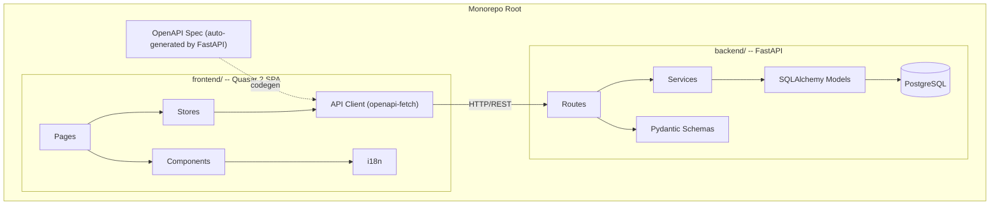
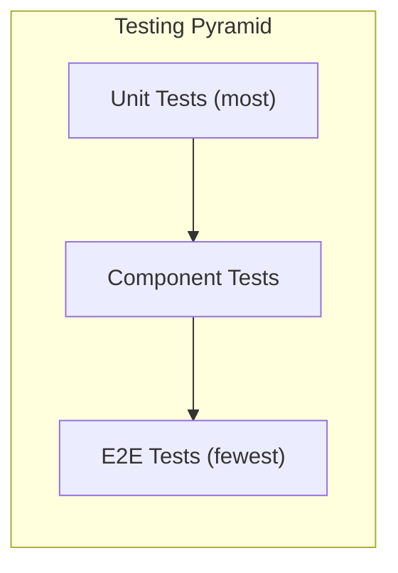

# Exetasi Implementation Plan

This document is the **canonical implementation plan** for building Exetasi as described in [Requirements.md](../../Requirements.md). It lives in the repo so contributors and agents can reference it without relying on local Cursor plan storage.

## Architecture Overview



## Tech Stack

**Frontend** (existing scaffold, will be moved to `frontend/`)

- Quasar 2, Vue 3, TypeScript (strict), Pinia (setup-syntax stores), vue-i18n 11, Vue Router 4 (hash mode)
- `openapi-typescript` + `openapi-fetch` for typed API client
- Vitest + `@vue/test-utils` for unit/component tests
- Playwright for E2E tests

**Backend** (new, `backend/`)

- FastAPI, Python 3.12+, Pydantic v2
- SQLAlchemy 2.0 (async) + asyncpg, Alembic for migrations
- Authlib for OAuth 2.0 (Google, GitHub, GitLab)
- uv for dependency management
- pytest + httpx (async) + factory-boy for tests

**Dev Infrastructure** (root)

- `docker-compose.yml` for PostgreSQL (+ optional pgAdmin)
- Shared Makefile or `justfile` for common commands
- CI-ready structure (lint, test, build)

## Monorepo Structure

```
exetasi/
  frontend/              # Quasar SPA (moved from root)
    src/
      api/               # Generated OpenAPI client + wrapper composables
      boot/              # Quasar boot files (i18n, auth, api)
      components/        # Shared components by domain
        auth/
        exam/
        grading/
        org/
        shared/          # Generic reusable components
      css/               # Global SCSS + Quasar variables
      i18n/              # Translation files
      layouts/           # Page wrapper layouts
      pages/             # Route-level page components
        auth/
        dashboard/
        exam/
        grading/
        org/
        profile/
      router/            # Vue Router setup + route guards
      stores/            # Pinia stores (one per domain)
      types/             # Shared TypeScript interfaces
    test/
      unit/              # Vitest unit tests
      component/         # Vue Test Utils component tests
      e2e/               # Playwright E2E tests
  backend/
    app/
      api/               # FastAPI route modules
        v1/
      core/              # Config, security, deps
      models/            # SQLAlchemy models
      schemas/           # Pydantic request/response schemas
      services/          # Business logic layer
    migrations/          # Alembic migrations
    tests/
      api/
      services/
    pyproject.toml
  docker-compose.yml     # PostgreSQL + any dev services
  Makefile               # dev, test, lint, format, codegen shortcuts
```

## Phase checklist

| Phase | Focus |
| ----- | ----- |
| 0 | Monorepo restructure, backend scaffold, testing infrastructure, dev tooling |
| 1 | Authentication (OAuth, sessions, user profile) |
| 2 | Organizations and membership |
| 3 | Exam and version management |
| 4 | Question and answer editor (all six types) |
| 5 | Exam taking flow |
| 6 | Grading queue |
| 7 | Analytics and reporting |
| 8 | Notifications, audit log, certificates, import/export, media storage |

---

### Phase 0: Monorepo Setup and Infrastructure

**Goal:** Restructure repo, set up both projects, establish dev workflow and testing infrastructure.

**Backend setup:**

- Initialize FastAPI project in `backend/` with uv
- SQLAlchemy 2.0 async engine + session management
- Alembic configuration
- Base model class with common fields (id, created_at, updated_at)
- Health check endpoint (`GET /api/v1/health`)
- pytest + httpx test infrastructure with DB fixtures (using test database)
- CORS middleware configured for frontend dev server

**Frontend changes:**

- Move all Quasar files into `frontend/` subdirectory
- Replace example-store (Options API) with setup-syntax pattern
- Remove scaffold demo code (EssentialLink, ExampleComponent, models.ts, IndexPage todos)
- Install and configure `openapi-typescript` + `openapi-fetch`
- Create API boot file that initializes the OpenAPI client
- Set up Vitest with `@vue/test-utils` (config, test helpers, component mounting utilities)
- Set up Playwright (config, base fixtures, first smoke test)
- Add codegen script: fetch OpenAPI spec from backend, generate types

**Root-level:**

- `docker-compose.yml` with PostgreSQL 16
- `Makefile` with targets: `dev-backend`, `dev-frontend`, `dev` (both), `test`, `lint`, `codegen`

**Exit criteria:** Both servers start, frontend can call backend health endpoint, one passing test on each side.

---

### Phase 1: Authentication and User Management

**Goal:** OAuth 2.0 login (Google, GitHub, GitLab), session management, user profile CRUD.

**Backend:**

- `User` model (id, username, bio, avatar_url, created_at, is_deleted)
- `OAuthAccount` model (provider, provider_user_id, user_id)
- `Session` model (token, user_id, expires_at, last_active_at) with sliding-window refresh (1-week inactivity expiry)
- OAuth 2.0 endpoints: `/auth/{provider}/authorize`, `/auth/{provider}/callback`
- User profile endpoints: `GET/PATCH /users/me`, `DELETE /users/me`
- Auth middleware: extract session token from cookie/header, populate `request.state.user`
- Username uniqueness validation

**Frontend:**

- Auth store (`useAuthStore`): login flow, session persistence, logout, current user
- Login page with OAuth provider buttons
- Auth boot file: check session on app start, silent token refresh
- Route guard: redirect unauthenticated users to login
- User profile page: view/edit username, bio, avatar
- Account deletion flow with confirmation dialog

**Key i18n keys:** `auth.login`, `auth.logout`, `auth.provider.*`, `profile.username`, `profile.bio`, `profile.deleteAccount`, `profile.deleteWarning`

**Tests:**

- Backend: OAuth callback (mocked provider), session creation/expiry, user CRUD, username uniqueness
- Frontend: Auth store unit tests, login page component test, route guard behavior
- E2E: Full login flow (mocked OAuth), profile edit, logout

---

### Phase 2: Organizations and Membership

**Goal:** Personal org auto-creation, team orgs, member management with roles.

**Backend:**

- `Organization` model (id, name, slug, description, avatar_url, is_personal, owner_user_id)
- `Membership` model (user_id, org_id, role: owner/editor/grader/viewer)
- Auto-create personal org on user registration (slug = username slug, updates on username change)
- Org CRUD endpoints: `POST/GET/PATCH /orgs`, `GET /orgs/{slug}`
- Membership endpoints: `POST/DELETE /orgs/{slug}/members`, `PATCH /orgs/{slug}/members/{username}/role`
- Role-based permission checks (dependency injection)
- Org deletion with cascade (exams, attempts, audit entries)
- "Last owner" guard: prevent sole owner from leaving/being demoted

**Frontend:**

- Org store (`useOrgStore`): current org, org list, members
- Org creation/edit pages
- Member management page (add by username, change roles, remove)
- Personal org warning when creating exams (slug changes with username)
- Org deletion confirmation with impact summary
- Org switcher in sidebar/header

**Tests:**

- Backend: Org CRUD, membership role checks, personal org slug sync, last-owner guard, cascade deletion
- Frontend: Org store tests, member management component tests
- E2E: Create org, invite member, change role, leave org

---

### Phase 3: Exam and Version Management

**Goal:** Exam CRUD, version lifecycle, section management.

**Backend:**

- `Exam` model (id, name, public_description, private_description, org_id, is_archived, visibility, created_by)
- `ExamVersion` model (id, exam_id, name, public_description, private_description, is_active, config JSON)
- `Section` model (id, version_id, name, descriptions, sort_order, config overrides, questions_to_draw)
- `ExamAllowlist` model (exam_id, user_id) for restricted visibility
- Exam endpoints: CRUD + archive/unarchive
- Version endpoints: create (copy from previous), activate, config update
- Section endpoints: CRUD + reorder
- Visibility: public vs restricted with allowlist management

**Frontend:**

- Exam store (`useExamStore`): exams list, current exam, versions
- Exam list page (with search, archive filter)
- Exam detail/edit page
- Version management panel: create new version (copy from), activate, config editor
- Section manager: add/remove/reorder sections, section config overrides
- Version config form covering all settings from the spec (time limit, randomization, scoring, etc.)
- QR code generation for sharing

**Tests:**

- Backend: Exam CRUD, version activation (auto-deactivate previous), section reordering, visibility checks
- Frontend: Exam store tests, version config form component tests
- E2E: Create exam, add version, configure sections, archive/unarchive

---

### Phase 4: Question and Answer Editor

**Goal:** Full question editor supporting all 6 question types.

This is the most complex frontend phase. Each question type has distinct UI requirements.

**Backend:**

- `Question` model (id, section_id, type, private_description, image_url, point_value, sort_order, config overrides)
- `QuestionPhrasing` model (id, question_id, markdown_text)
- Answer models per type:
  - `MCOption` (id, question_id, text, image_url, is_correct, percentage_weight, is_in_incorrect_pool)
  - `FillBlank` (id, question_id, phrasing_id, blank_number, grading_mode, accepted_values JSON, point_weight)
  - `DragDropItem` (id, question_id, text, image_url, correct_position)
  - `MatchingPair` (id, question_id, left_text, left_image_url, right_text, right_image_url, is_distractor)
- Question CRUD endpoints with type-specific validation
- Reorder + move-between-sections endpoints
- Image upload endpoint (pluggable storage backend interface)

**Frontend:**

- Question store (`useQuestionStore`)
- Question list per section with drag-to-reorder
- Type selector when creating a question
- Type-specific editor components:
  - `McEditor.vue`: correct/incorrect options, weights, total-to-show, penalty config
  - `OpenEndedEditor.vue`: character limit config
  - `FillBlankEditor.vue`: markdown with `{{n}}` preview, per-blank grading mode + accepted values
  - `DragDropEditor.vue`: item list with correct ordering
  - `MatchingEditor.vue`: pair editor + distractor items
  - `InformationalEditor.vue`: markdown-only content
- Markdown preview for question phrasings
- Image upload component (reused across types)
- Multiple phrasings editor per question

**Tests:**

- Backend: CRUD per question type, validation (e.g., MC must have enough incorrect options), reorder/move
- Frontend: Each editor component tested with Vue Test Utils
- E2E: Create one question of each type, edit, reorder

---

### Phase 5: Exam Taking Flow

**Goal:** Full exam-taking experience from start to submission.

**Backend:**

- `Attempt` model (id, user_id, version_id, started_at, submitted_at, is_complete, score, max_score, drawn_questions JSON)
- `AttemptAnswer` model (id, attempt_id, question_id, phrasing_id, response JSON, score, is_graded, grader_feedback)
- `AttemptEvent` model (id, attempt_id, question_id, event_type, timestamp)
- Start attempt endpoint: draw questions from sections, randomize per config, return attempt
- Save answer endpoint: persist individual answers + event log (continuous save)
- Submit attempt endpoint: auto-grade all auto-gradable questions, compute score
- Resume attempt endpoint: return current state for in-progress attempt
- Scoring engine implementing all formulas from spec
- Retake validation + retake override endpoint

**Frontend:**

- Attempt store (`useAttemptStore`): current attempt state, answers, timer
- Exam landing page (description, start button, retake status)
- Question display components (one per type, read-only/interactive variants):
  - `McQuestion.vue`, `OpenEndedQuestion.vue`, `FillBlankQuestion.vue`, `DragDropQuestion.vue`, `MatchingQuestion.vue`, `InformationalQuestion.vue`
- Exam shell layout: progress bar, timer, question navigation, flag toggle
- Auto-save on answer change (debounced)
- Timer with pause/resume support
- Auto-submit on time expiry
- Review screen (flagged/unanswered summary)
- Results page (score, pass/fail, per-question breakdown)
- Attempt history page
- Silent session refresh during exam

**Tests:**

- Backend: Scoring engine (unit tests for each formula), attempt lifecycle, question drawing randomization, auto-submit
- Frontend: Each question type display component, timer behavior, auto-save logic
- E2E: Complete exam flow (start, answer questions, submit, view results), pause/resume, time expiry

---

### Phase 6: Grading Queue

**Goal:** Manual grading workflow for open-ended and manual fill-in-the-blank questions.

**Backend:**

- Grading queue endpoint: list attempts with pending manual grades (filterable, sortable)
- Lock/unlock mechanism: lock on open, release on navigate away or idle timeout
- Grade submission endpoint: score + feedback per question, immediate visibility to test-taker
- Auto-complete attempt when all questions graded

**Frontend:**

- Grading store (`useGradingStore`)
- Grading queue page: filterable list with exam, user, timestamp, pending count
- Grading view: question display, student response, score input, feedback textarea
- Lock status indicator
- Partial save support

**Tests:**

- Backend: Queue filtering/sorting, lock acquisition/release/timeout, grade persistence, score recalculation
- Frontend: Queue list component, grading form validation
- E2E: Pick attempt from queue, grade questions, verify student sees feedback

---

### Phase 7: Analytics and Reporting

**Goal:** Per-version metrics, cross-version comparison, data export.

**Backend:**

- Analytics endpoints: average score, pass rate, score distribution, per-question difficulty, average time per question, per-option breakdown
- Cross-version comparison endpoint
- Aggregated metrics (overall pass rate, total attempts)
- Date range filtering on all analytics
- CSV and JSON export endpoints

**Frontend:**

- Analytics store (`useAnalyticsStore`)
- Analytics dashboard page per exam version
- Charts: score histogram, difficulty bar chart, time-per-question, option breakdown
- Cross-version comparison view (side-by-side metrics)
- Date range picker
- Export buttons (CSV, JSON)
- Chart library: consider Chart.js via vue-chartjs or ECharts via vue-echarts

**Tests:**

- Backend: Analytics query accuracy with fixture data, export format validation
- Frontend: Chart component rendering with mock data
- E2E: View analytics for an exam with attempts, export data

---

### Phase 8: Notifications, Audit Log, Certificates, Import/Export

**Goal:** All remaining features to reach full spec compliance.

**Notifications:**

- Backend: `Notification` model, create-on-event triggers, mark-as-read endpoint
- Frontend: Notification bell in header with unread count, notification center dropdown/page

**Audit Log:**

- Backend: `AuditEntry` model, log events from all mutation endpoints, export endpoint (TSV/CSV/JSON)
- Frontend: Audit log page for org owners, filterable by category and date range

**PDF Certificates:**

- Backend: Certificate template model (image + field positions), PDF generation (e.g., reportlab or WeasyPrint)
- Frontend: Certificate template editor with drag-and-drop field placement + manual coordinate input, download button on results page

**Import/Export:**

- Backend: Serialize/deserialize exam structure in JSON, TOML, YAML
- Frontend: Export button on exam page, import wizard (file upload, preview, confirm)

**Media Storage:**

- Backend: Pluggable storage interface with implementations for local disk, S3, GCS, R2, external URL
- Configuration via environment variables

**Tests:** Each sub-feature gets its own unit/integration tests; E2E for certificate download and import/export round-trip.

---

## Testing Strategy



- **Unit tests (Vitest / pytest):** Pure functions, store actions, scoring engine, business logic, API service layer
- **Component tests (Vue Test Utils):** Each Vue component in isolation with mocked stores/API
- **E2E tests (Playwright):** Critical user journeys per phase -- auth flow, exam creation, exam taking, grading
- **Backend integration tests (pytest + httpx):** API endpoints against a real test database with fixtures
- **Coverage target:** 80%+ for backend services, 70%+ for frontend stores/components

## Cross-Cutting Concerns (Applied Throughout)

- **i18n:** Every user-visible string through `t('key')` from Phase 0 onward
- **Accessibility:** WCAG 2.1 AA on all components; use Quasar's built-in a11y features, add ARIA attributes where needed
- **Responsiveness:** Mobile-first layouts using Quasar's grid system and responsive utilities
- **Error handling:** Global API error interceptor, user-friendly error messages via i18n, toast notifications for transient errors
- **Loading states:** Skeleton loaders or spinners on all async operations
- **Security:** CSRF protection, input sanitization, role-based route guards on frontend, permission decorators on backend
